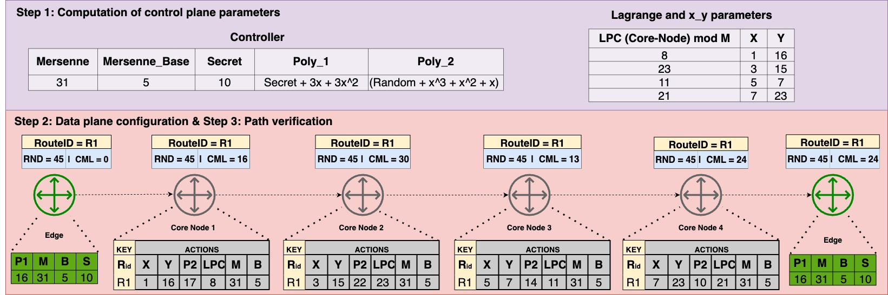
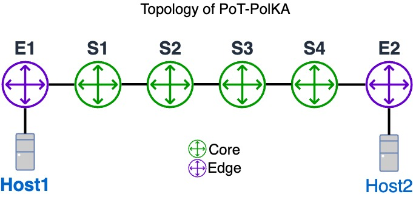

# PoT-PolKA: Let the Edge Control the Proof-of-Transit in Path-Aware Networks

## 1) Preparing the environment

To download the VM image, we have to use the following link:

[[6.7GB Size] - Lubuntu 20.04 x64](https://drive.google.com/file/d/1oozRqFO2KjjxW0Ob47d6Re4i6ay1wdwg/view?usp=sharing) - Mininet-WiFi with P4 (_pass: wifi_)

After downloading, we have to perform the login (user: wifi, pass: wifi) and clone the repository as follows:

```sh
$ git clone git@github.com:nerds-ufes/polka.git
```

To compile the P4 PoT-PolKA codes, you have to perform the following command:

```sh
$ cd mininet/pot-polka/pot-polka
$ make
```

Is import to note that for each mofification, we have to recompile by using the previous command.

## 2) Step By Step Description

This test explore a linear topology as shown in the figure below:

Step 1 : PoT Computation at the control plane
Step 2 : Data plane configuration



## 3) Topology Description

This test explore a linear topology as shown in the figure below:



To create the topology by using Mininet, we have to perform the following command:

```sh
$ sudo python3 run_topology.py
```


## References

- Borges, Everson S., et al. "PoT-PolKA: Let the Edge Control the Proof-of-Transit in Path-Aware Networks." *IEEE Transactions on Network and Service Management* (2024). DOI: [10.1109/TNSM.2024.3389457](https://doi.org/10.1109/TNSM.2024.3389457). [Paper Link](https://ieeexplore.ieee.org/document/10500862)
